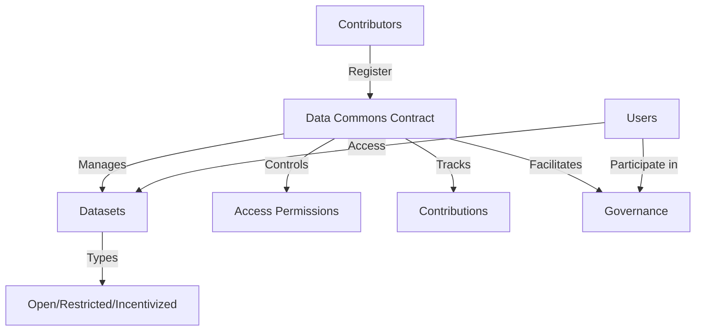

# Basic Convention: Data Commons

A decentralized platform for collaborative data management, enabling secure storage, validation, and community-driven governance.

## Overview

Basic Convention is a blockchain-powered platform that empowers communities by providing:
- Transparent and immutable data management
- Decentralized access control mechanisms
- Community-driven governance
- Flexible data sharing models
- Incentivized contribution and attribution

The platform creates a trustless environment where data integrity, proper attribution, and collaborative decision-making are core principles.

## Architecture

The system leverages a core smart contract to manage:



### Core Components:
- Contributor Registry
- Dataset Management
- Access Control System
- Contribution Tracking
- Community Governance

## Contract Documentation

### data-commons.clar

The primary contract managing collaborative data management functionality.

#### Key Features:
- Contributor registration and verification
- Dataset registration and metadata storage
- Flexible access control models
- Contribution tracking and attribution
- Decentralized governance mechanism

#### Access Paradigms:
- `ACCESS-TYPE-OPEN`: Freely accessible resources
- `ACCESS-TYPE-PAID`: Value-based access
- `ACCESS-TYPE-PERMISSIONED`: Curated access rights

## Getting Started

### Prerequisites
- Clarinet
- Stacks wallet for deployment/interaction

### Basic Usage

1. Register as a contributor:
```clarity
(contract-call? .data-commons register-contributor "Jane Smith" "Research Collective" "Data Scientist")
```

2. Register a dataset:
```clarity
(contract-call? .data-commons register-dataset 
    "dataset-001"
    "Urban Green Spaces Study"
    "Geospatial Analysis"
    "Metropolitan Area"
    u1683849600
    "Comprehensive mapping methodology"
    0x... ;; data hash
    u1    ;; open access
    u0    ;; free
)
```

3. Access a dataset:
```clarity
(contract-call? .data-commons check-dataset-access "dataset-001" tx-sender)
```

## Function Reference

### Public Functions

#### Contributor Management
- `register-contributor`: Register a new data contributor
- `get-contributor`: Retrieve contributor information

#### Dataset Management
- `register-dataset`: Register a new dataset
- `verify-dataset`: Verify a dataset (admin only)
- `get-dataset`: Retrieve dataset information

#### Access Control
- `grant-dataset-access`: Grant access to restricted dataset
- `access-paid-dataset`: Purchase access to value-based dataset
- `check-dataset-access`: Validate access permissions

#### Contributions
- `cite-dataset`: Acknowledge dataset usage
- `get-contribution`: Retrieve contribution details

#### Governance
- `create-proposal`: Initiate community proposal
- `vote-on-proposal`: Participate in active proposals
- `finalize-proposal`: Conclude proposal voting cycle

## Development

### Testing
1. Clone the repository
2. Install Clarinet
3. Run tests:
```bash
clarinet test
```

### Local Development
1. Start Clarinet console:
```bash
clarinet console
```
2. Deploy contracts:
```clarity
(contract-call? .ocean-vault ...)
```

## Security Considerations

### Access Control
- Only registered researchers can register datasets
- Dataset access is strictly controlled based on type
- Paid access requires successful STX transfer
- Permission grants only by dataset owners

### Governance
- Only registered researchers can participate
- Proposals have fixed voting periods
- Vote counting is transparent and immutable
- Status changes are permanent once finalized

### Limitations
- On-chain storage limited to metadata
- Actual dataset storage should be off-chain
- Access control applies to metadata only
- Citations must be by registered researchers